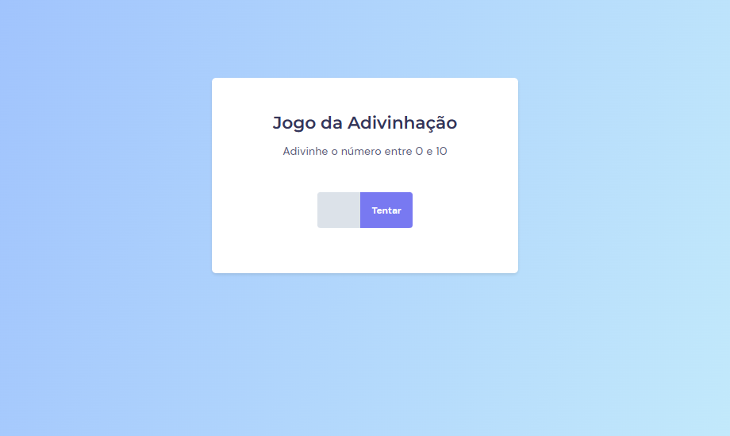
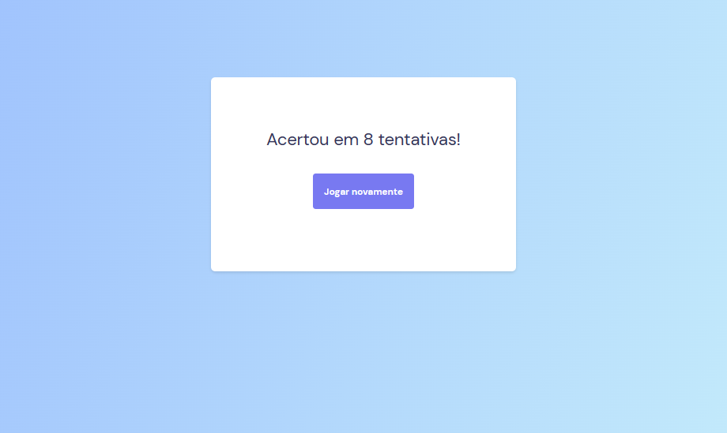

<h1>Projeto Jogo de Adivinhação</h1>

  
   
  

 

> Trilha Explorer 06

 

## 🚀 Tecnologias

Esse projeto foi desenvolvido com as seguintes tecnologias:

- HTML
- CSS
- Javascript
- Git
- Github
- Figma

## 💻 Projeto

Projeto prático de uma Jogo de Adivinhação da Trilha Explorer da Rocketseat.

- [Acesse o projeto finalizado, online](https://hugolinobg.github.io/HorrorGame/)

## 🔖 Layout

Você pode visualizar o layout do projeto através [DESSE LINK](<https://www.figma.com/file/GTYdeLFkBiVH3ZmmsNBGkr/Jogo-Adivinha%C3%A7%C3%A3o-(Copy)?node-id=0-1&t=jo9vhIYZ8woWmFr2-0>). É necessário ter conta no [Figma](https://figma.com) para acessá-lo.

## ✉️ [Contato](https://links.hugolino.dev)

hugolino2609@gmail.com
